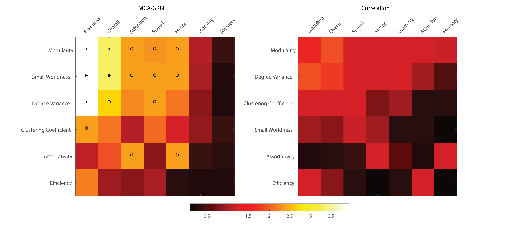

  

**I am currently part of the Solution Architecture and Engineering team at NVIDIA where I focus on Artificial Intelligence & High Performance computing applications in Healthcare. I have a PhD in Biomedical Engineering with expertise in medical imaging, machine/deep learning, computer vision techniques, image and time-series analysis.** 

* * *

  

# Brief Summary <a href="/index.html#Top"><i class="fas fa-link"></i></a>

My current role at NVIDIA entails helping diverse R&D teams leverage the power of GPUs. My work focuses on enhancing the various aspects of pipelines (optimized training, improved inference, ehnaced deployment strategies) that can make it easier for teams to bring AI into the clinical practice. More details on what [NVIDIA is upto, especially in Healthcare](https://www.nvidia.com/en-us/industries/healthcare-life-sciences/). 

For my _PhD thesis_ project, I worked on the development of a **novel software framework** for analysis of fMRI data of the human brain. Results from this work have been published in high-ranking journals such as **Neuroimage** and **Neuroimage: Clinical**, among others. I had additionally worked on **Computer Aided Diagnostics**, using methods for image characterization and predicting the presence/absence of disease.

Prior to graduate studies I worked for three years with **Philips Healthcare**, India, as a _Field Service Engineer for Imaging Systems_ (specialization in **MRI**). 

My experiences thus far have always given me the opportunity to work in highly interdisciplinary environments with close collaborations with engineers, mathematicians, neurologists, radiologists as well as skilled technicians. I have a good disposition towards teamwork, inter-personal communication and service provider-client relationships. 

* * *

  

# Work Experience <a href="/index.html#Top"><i class="fas fa-link"></i></a>
<table>
  <tr>
    <td >April 2019 - Current</td>
    <td>
        <strong>Solutions Architect - Healthcare and Life Sciences</strong>
         
      NVIDIA
    </td>
  </tr>
  <tr>
    <td>September 2010 - May 2013</td>
    <td>
        <strong>Field Service Engineer - MRI</strong>
         
      Philips - Healthcare
    </td>
  </tr>
   
</table>
* * *

  

# Education <a href="/index.html#Top"><i class="fas fa-link"></i></a>
<table>
  <tr>
    <td >Aug 2013 - April 2019</td>
    <td>
        <strong>Ph.D. in Biomedical Engineering</strong>
         
      University of Rochester, Rochester, NY
    </td>
  </tr>
  <tr>
    <td>Aug 2013 - May 2015</td>
    <td>
        <strong>M.S. in Biomedical Engineering</strong>
         
      University of Rochester, Rochester, NY
    </td>
  </tr>
  <tr>
    <td>Aug 2006 - May 2010</td>
    <td>
        <strong>B.E. in Biomedical Engineering</strong> 
         
      Manipal University, Karnataka, India
    </td>
  </tr>
   
</table>
* * *

&nbsp;

# Selected Publications <a href="/index.html#Top"><i class="fas fa-link"></i></a>

<strong>Alteration of brain network topology in HIV-associated neurocognitive disorder: A novel functional connectivity perspective.</strong>

<em>Proposing novel imaging derived biomarkers for disease</em>

<strong>Abidin AZ</strong>, DSouza AM, Nagarajan MB, Qiu X, Schifitto G, Wism&uuml;ller A. (NeuroImage: Clinical. 2018;17:768-77.) [<a href="https://www.sciencedirect.com/science/article/pii/S2213158217303054">Link</a>]

<strong>Detecting cognitive impairment in HIV-infected individuals using mutual connectivity analysis of resting state functional MRI.</strong>

<em>Distinguishing subjects with and without cognitive impairment and localizing the effects of disease within the brain</em>

<strong>Abidin AZ</strong>, DSouza AM, Schifitto G, Wism&uuml;ller A. (Journal of NeuroVirology. 2020;1-13.) [<a href="https://link.springer.com/article/10.1007/s13365-019-00823-1">Link</a>]

<strong>Deep transfer learning for characterizing chondrocyte patterns in phase contrast X-Ray computed tomography images of the human patellar cartilage</strong>

<em>Characterization of Phase Contrast CT images using features extracted from CNNs and also "hand-crafted" features</em>

<strong>Abidin AZ</strong>, Deng B, DSouza AM, Nagarajan MB, Coan P, Wism&uuml;ller A. (Computers in biology and medicine. 2018;95:24-33.) [<a href="https://www.sciencedirect.com/science/article/pii/S0010482518300167">Link</a>].

<strong>Mutual connectivity analysis of resting-state functional MRI data with local models.</strong>

<em>Novel perspective for studying fMRI time-series as a chaotic dynamical system</em>

DSouza AM,&nbsp;<strong>Abidin AZ</strong>, Chockanathan U., Schifitto G., &amp; Wism&uuml;ller A. (NeuroImage. 2018; 178:210-223.), [<a href="https://www.sciencedirect.com/science/article/pii/S1053811918304452">Link</a>]

<strong>Exploring connectivity with large-scale Granger causality on resting-state functional MRI.</strong>

<em>A new and improved take on Granger Causality for large time-series systems</em>

DSouza AM,&nbsp;<strong>Abidin AZ</strong>, Leistritz L, Wism&uuml;ller A. (Journal of neuroscience methods. 2017;287:68-79.) [<a href="https://www.sciencedirect.com/science/article/pii/S0165027017301711">Link</a>].

### For a full list please [download my CV](/data/AnasAbidin_CV.pdf) or check my <a href="https://scholar.google.com/citations?user=C1IIlf4AAAAJ&hl=en" target="_blank"><i class="fas fa-graduation-cap fa-1x"></i></a> page
* * *

  

# Skills & Interests <a href="/index.html#Top"><i class="fas fa-link"></i></a>

| Languages         | **Python (NumPy, scikit-learn, Pandas, [RAPIDS](https://developer.nvidia.com/rapids)), MATLAB**, Shell-scripting |
| Python Frameworks | **PyTorch, TensorFlow**|
| Interests         | **Machine Learning, Deep Learning, Image & Signal Processing, Medical Imaging, Statistical Modeling, Graph Theory**|

